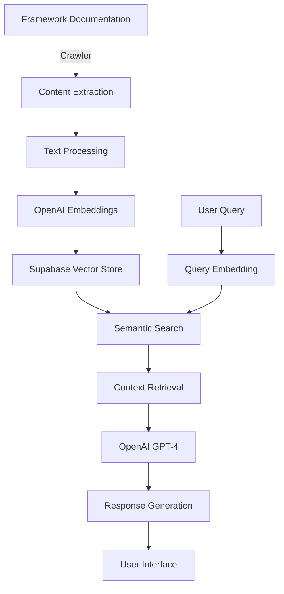
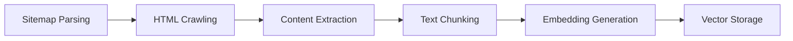
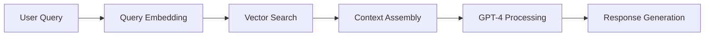

# DocuGPT: Framework Documentation RAG Assistant 🤖

[](https://choosealicense.com/licenses/mit/)
[](https://www.python.org/downloads/)
[](https://streamlit.io)
[](https://openai.com)

## The Problem We Solve 🎯

Large Language Models (LLMs) are incredibly powerful, but they face a significant limitation: their knowledge is confined to their training data. This means:

- No access to up-to-date framework documentation
- Potentially outdated or incorrect answers
- No knowledge of new features or APIs
- No access to framework-specific code examples

DocuGPT solves this problem by implementing a sophisticated RAG (Retrieval Augmented Generation) system that:
1. Automatically crawls and indexes any framework's documentation
2. Enables natural language queries about the documentation
3. Provides accurate, up-to-date answers with source references

## System Architecture 🏗️



## Technical Stack 🛠️

### Core Technologies
- **Python 3.8+**: Base programming language
- **OpenAI GPT-4**: LLM for response generation
- **Supabase**: Vector store and document management
- **Streamlit**: Web interface framework

### RAG Implementation
- **Embedding Model**: OpenAI text-embedding-ada-002 (1536 dimensions)
- **Vector Store**: Supabase pgvector with IVFFLAT indexing
- **Similarity Search**: Cosine similarity with framework filtering
- **Context Window**: Dynamic chunking with overlap

### Web Crawling
- **Crawl4AI**: Asynchronous web crawling framework
- **BeautifulSoup4**: HTML parsing and content extraction
- **Markdown**: Documentation format processing
- **AsyncIO**: Asynchronous operations

### User Interface
- **Streamlit**: Interactive chat interface
- **Dynamic Theming**: Framework-specific color schemes
- **Real-time Updates**: Async response generation
- **Source Attribution**: Automatic reference linking

## How It Works 🔄

### 1. Documentation Indexing Pipeline


### 2. Query Processing Pipeline


## Setup and Installation 🚀

### Prerequisites
- Python 3.8+
- Supabase account (for vector storage)
- OpenAI API key

### Installation Steps

1. Clone the repository:
```bash
git clone https://github.com/your-username/docugpt.git
cd docugpt
```

2. Install dependencies:
```bash
pip install -r requirements.txt
```

3. Configure environment variables (.env):
```env
OPENAI_API_KEY=your-api-key
SUPABASE_URL=your-supabase-url
SUPABASE_SERVICE_KEY=your-supabase-key
```

### Supabase Configuration

1. Create the documents table:
```sql
create table documents (
  id bigint primary key generated always as identity,
  content text,
  url text,
  title text,
  framework text,
  embedding vector(1536)
);

create index on documents using ivfflat (embedding vector_cosine_ops)
    with (lists = 100);
```

2. Create the similarity search function:
```sql
create or replace function match_documents(
  query_embedding vector(1536),
  match_count int,
  framework_filter text
) returns table (
  id bigint,
  content text,
  url text,
  title text,
  similarity float
)
language plpgsql
as $$
begin
  return query
  select
    id,
    content,
    url,
    title,
    1 - (documents.embedding <=> query_embedding) as similarity
  from documents
  where framework = framework_filter
  order by documents.embedding <=> query_embedding
  limit match_count;
end;
$$;
```

## Adding a New Framework 🔧

1. Add framework configuration in `chat_interface.py`:
```python
FRAMEWORKS = {
    'your_framework': {
        'name': 'Framework Name',
        'description': 'Framework Description',
        'docs_url': 'https://docs.your-framework.com',
        'color': '#hexcolor',
        'emoji': '🔧'
    }
}
```

2. Add crawling configuration in `crawl_docs.py`:
```python
FRAMEWORKS = {
    'your_framework': DocsFramework(
        'your_framework',
        'https://docs.your-framework.com/sitemap.xml',
        'https://docs.your-framework.com'
    )
}
```

3. Run the crawler:
```bash
python crawl_docs.py --framework your_framework
```

## Running the Project 💻

1. Start the interface:
```bash
streamlit run chat_interface.py
```

2. Access http://localhost:8501 in your browser

## Features ✨

- 🔍 Semantic search in up-to-date documentation
- 💬 Intuitive chat interface
- 🎨 Dynamic framework-specific themes
- 📚 Multi-framework support
- 🔗 Source references and attribution
- ⚡ Fast and accurate responses
- 🔄 Automatic documentation updates
- 🛡️ Error handling and retry mechanisms
- 📊 Query logging and analytics

## Project Structure 📁

```
DocuGPT
├── chat_interface.py      # Streamlit interface
├── rag_engine.py         # RAG implementation
├── crawl_docs.py         # Documentation crawler
├── requirements.txt      # Dependencies
├── .env                  # Configuration
└── docs/                 # Documentation
```

## Contributing 🤝

1. Fork the project
2. Create your feature branch (`git checkout -b feature/AmazingFeature`)
3. Commit your changes (`git commit -m 'Add some AmazingFeature'`)
4. Push to the branch (`git push origin feature/AmazingFeature`)
5. Open a Pull Request

## Performance Metrics 📊

- Average response time: ~2-3 seconds
- Embedding dimension: 1536
- Context window: Up to 8k tokens
- Supported frameworks: Unlimited
- Documentation update frequency: Configurable

## License 📄

This project is licensed under the MIT License - see the [LICENSE](LICENSE) file for details.

## Contact 📧

Your Name - [@your_twitter](https://twitter.com/your_twitter)

Project Link: [https://github.com/your-username/docugpt](https://github.com/your-username/docugpt)

## Acknowledgments 🙏

- OpenAI for GPT-4 and embeddings
- Supabase for vector storage
- Streamlit for the UI framework
- All contributors and users 